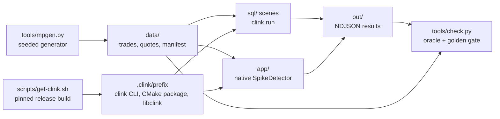

# market-pulse

[](https://github.com/orhaugh/market-pulse/actions/workflows/ci.yml)
[](LICENSE)
[](https://github.com/orhaugh/clink/releases/tag/v0.4.0)

A market-data pipeline built on [clink](https://github.com/orhaugh/clink),
the embedded-first, Arrow-native stream processing engine. One deterministic
synthetic trade tape, and every serious streaming problem it poses - candles,
late data, joins, pattern detection, anomalies, state, replay, scale-out -
solved with the engine features built for it.

This repository is a downstream consumer, not part of clink: it installs a
pinned clink release the way any project would, runs SQL scenes through the
`clink` CLI, builds a native operator against the installed CMake package,
and verifies everything against an independent oracle. It doubles as a
worked example and as an integration test of the release it pins
(currently **v0.4.0** - its first run against an installed prefix found
three real defects that were fixed before that release was tagged).

- [Why a stream engine, and why clink](#why-a-stream-engine-and-why-clink)
- [Quick start](#quick-start)
- [How the repository fits together](#how-the-repository-fits-together)
- [The tape](#the-tape) · [The scenes](#the-scenes) · [The native operator](#the-native-operator)
- [State is data, incidents replay](#state-is-data-incidents-replay) · [Python](#python) · [The same SQL, on a cluster](#the-same-sql-on-a-cluster) · [on a live feed](#the-same-sql-on-a-live-feed)
- [Verification](#verification) · [Pinning](#pinning)

## Why a stream engine, and why clink

The tape looks like a file, so it is fair to ask why a script over a
dataframe is not enough. The answer is in the data's shape, which mirrors
every real market feed:

- **Arrival order disagrees with event time.** Most events land within
  three seconds of their timestamp; some land 40 seconds after their minute
  closed. A correct one-minute bar is defined by *event* time, so something
  must track how far the event clock has provably advanced (watermarks),
  decide when a window's answer is final, and choose what to do with data
  that arrives after it (drop, or hold the window open for a bounded grace
  band). Scenes 01 and 01b are that decision, made both ways, with the
  difference reconciled to the straggler count exactly.
- **The input never ends, in principle.** A sort-then-group script works
  precisely because a file is finite. The same candles query runs here
  twice: embedded over the file, and on a cluster over a Kafka topic where
  no end ever comes and results must stream out as windows close. The SQL
  is identical - which is the point.
- **The interesting answers are stateful, per key.** The anomaly detector
  keeps a per-symbol price estimate; the join buffers 300 ms of quotes per
  symbol; Top-N retains contenders per window. That state has to be
  keyed, bounded (watermark eviction, not unbounded buffering), and it has
  to survive a process death (checkpoints) or the numbers after a restart
  are quietly wrong.

Any serious stream engine addresses those. clink is the one this project
uses for three reasons that show up in the scenes rather than the brochure:

1. **Embedded-first.** Every scene is `clink run <file>.sql`: one process,
   no daemons, no cluster to stand up, first result in about a second. The
   distributed run is the same engine and the same SQL, deferred until the
   moment it is actually needed - not a prerequisite for hello-world.
2. **Arrow-native, end to end.** Query results arrive in Python as pyarrow
   tables over the Arrow C stream interface; checkpoints are documented
   Arrow IPC that DuckDB and pyarrow open directly (`scene-state-as-data.sh`
   queries a stopped job's state without the engine); on the cluster path,
   Kafka JSON decodes straight to Arrow columns and moves between workers
   without materialising rows. Nothing here needed a bespoke export format.
3. **Incidents replay deterministically.** The flight recorder captures
   what each operator consumed; `clink replay --verify` re-executes it
   offline, byte-identically, and `--emit-test` freezes the incident into a
   permanent regression test. For market data - where "why did the 09:17
   bar print that number" is a compliance question, not a curiosity - that
   is the difference between an answer and a shrug.

clink's own claims, benchmarks and internals live in
[its repository](https://github.com/orhaugh/clink) and
[documentation](https://orhaugh.github.io/clink/); this project only
demonstrates them.

## Quick start

Three commands: install the pinned release, generate the tape, run the
scenes. On Linux x86_64 the install is a prebuilt SDK download from the
clink release (about a minute, no compiler); elsewhere it builds from
source, with the toolchain restored from a prebuilt archive where one
exists.

```bash
scripts/get-clink.sh            # prebuilt SDK, or build the tag into .clink/
python3 tools/mpgen.py --out data
scripts/run-scenes.sh           # all eight SQL scenes + verification
```

`run-scenes.sh` ends with the checker: every scene's output is gated on
semantic properties (the injected incidents are found, totals match an
independently computed oracle) plus exact golden figures for the default
seed.

## How the repository fits together



| Path | What it is |
|------|------------|
| `scripts/get-clink.sh` | installs the pinned clink release into `.clink/` (clone tag, bootstrap the pinned Arrow toolchain, `cmake --install`); everything below consumes that prefix |
| `tools/mpgen.py` | the deterministic tape generator; `data/manifest.json` records exact counts and incident coordinates for the checker |
| `sql/` | the numbered SQL scenes, run by `scripts/run-scenes.sh` via `clink run` |
| `app/` | the native operator: a standalone CMake project on `find_package(clink)`, with `clink::test_support` tests |
| `scripts/scene-*.sh` | the state-as-data and deterministic-replay tours |
| `python/candles.py` | the embedded-in-Python scene (pyclink over `libclink`) |
| `cluster/` | docker-compose Coordinator/Workers/Kafka and the distributed twin of scene 01 |
| `tools/check.py`, `tests/expected_seed42.json` | the oracle checks and frozen golden figures every run is gated on |

Everything a run produces lands in `data/` and `out/` (both gitignored);
the repository itself stays clean.

## The tape

`tools/mpgen.py` writes a simulated trading hour - about 114k trades and
229k quotes across 12 fictional symbols - deterministically from a seed:
the same seed always produces byte-identical files, which is what lets CI
assert exact figures. Event time and arrival order deliberately disagree:
most events arrive within 3 seconds of their timestamp, and exactly 25
trades arrive 30-45 seconds after their minute closed.

Three incidents are injected at known coordinates (recorded in
`data/manifest.json`, printed at generation time):

| Incident | What | Caught by |
|----------|------|-----------|
| fat finger | one print at 8x the prevailing price, minute 17 | scene 01 (bar high), the native detector |
| v-shape | 5 minutes down, 5 minutes up, noise-free ramp; quoted spreads widen 3x while it runs | scenes 03 and 04 |
| burst | 15x trade rate for 3 minutes | scenes 02 and 05 |

All symbols, issuers and prices are synthetic; any resemblance to a listed
instrument is coincidental.

## The scenes

Each scene is a plain SQL file run by the pinned `clink` CLI - one process,
no daemons, results in seconds. Together they exercise most of the engine's
SQL surface:

| Scene | Engine capability |
|-------|-------------------|
| `01_candles.sql` | event-time tumbling windows, watermarks; late trades beyond the horizon are dropped |
| `01b_candles_lateness.sql` | `allowed_lateness_ms`: the same query holds windows open for a grace band and recovers exactly the 25 stragglers |
| `02_volume_leaders.sql` | hopping windows + Top-N (`ROW_NUMBER() ... WHERE rn <= 3`) into an upsert sink with changelog compaction |
| `03_spread.sql` | stream-stream interval join (each trade against the quotes from its preceding 300 ms), state bounded by watermark eviction |
| `04_reversal_pattern.sql` | `MATCH_RECOGNIZE` over the bars scene 01 wrote: quantified pattern, thresholds as expressions over `PREV`, an optional step absorbing the flat trough bar |
| `05_sessions.sql` | session windows: the burst fuses one symbol's trading into 3-minute sessions while everything else stays fragmented |
| `06_cumulate.sql` | cumulate windows: the expanding session-to-date volume board, one query |
| `07_running_stats.sql` | OVER windows: running counts, a bounded 100-row moving average, `LAG` |

Scene 04 reads the NDJSON scene 01 wrote - pipelines compose through open
formats, no connector required between them.

## The native operator

`app/` is a self-contained CMake project consuming the installed package
with `find_package(clink REQUIRED)` - the same way any production job
would:

```bash
cmake -S app -B app/build -DCMAKE_PREFIX_PATH=$PWD/.clink/prefix
cmake --build app/build --parallel
./app/build/mp_anomaly            # exactly one alert: the injected fat finger
ctest --test-dir app/build        # operator tests via clink::test_support
```

`SpikeDetector` is a keyed `KeyedProcessFunction`: a per-symbol EWMA of the
trade price lives in clink keyed state, a print deviating more than 15%
raises an alert, and alerted prints do not update the estimate, so one bad
tick cannot poison the baseline that caught it. The operator carries a
stable uid, which is what makes its state addressable across snapshots,
restores and rescale. The tests drive it through clink's public testing
framework: per-key state inspected through the production read path, and a
snapshot -> restore round trip proving the state survives a checkpoint.

## State is data, incidents replay

Two scenes exercise the capabilities clink stakes out as its own:

```bash
scripts/scene-state-as-data.sh
```

runs a totals job with checkpointing on, then - engine stopped - queries
the final checkpoint with SQL (`clink state-query`), exports it as plain
Parquet (`clink state-export`), and opens that file from DuckDB or pyarrow.
Snapshots are documented Arrow IPC, not a proprietary blob.

```bash
scripts/scene-replay.sh
```

runs the candles pipeline with the flight recorder on, then re-executes
every captured operator offline and verifies the emissions are
byte-identical (`clink replay --verify`), and freezes one operator's epoch
into a self-contained regression bundle (`--emit-test`): capture, starting
state, golden emissions and a generated test.

## Python

```bash
pip install pyarrow && pip install .clink/src/python
export CLINK_LIB=$PWD/.clink/prefix/lib/libclink.dylib   # .so on Linux
python3 python/candles.py
```

The same engine, embedded in the Python process through a pure-C ABI; the
720 bars arrive as a pyarrow table over the Arrow C stream interface, no
serialisation detour.

## The same SQL, on a cluster

```bash
cluster/run.sh        # docker compose: coordinator + 2 workers + kafka
```

brings up a real Coordinator/Worker cluster using the release's published
runtime image, pipes the tape onto a Kafka topic followed by end-of-session
marker prints (a streaming source's watermark only advances when events
arrive, so the markers are what close the final minute - exactly as a real
feed's session-close messages do), submits `cluster/candles_kafka.sql` (the
distributed twin of scene 01) at parallelism 4 through the coordinator's
HTTP API, and gates on exactly 720 bars arriving on the output topic. The dashboard at
<http://localhost:8081> shows per-operator rates, backpressure and
watermarks while it runs. Kafka JSON decodes straight to Arrow columns and
the keyed shuffle moves those columns between workers without materialising
rows.

One honest limitation, called out rather than worked around: SQL jobs
submitted to a cluster do not yet take a per-job checkpoint configuration
(compiled-job submissions do), so this scene gates on exact counts instead
of demonstrating kill-a-worker recovery.

## The same SQL, on a live feed

```bash
scripts/scene-live.sh                                    # ~2000 live trades
LIVE_SYMBOL=ethusdt LIVE_MESSAGES=10000 scripts/scene-live.sh
BINANCE_HOST=stream.binance.us scripts/scene-live.sh     # geo-restricted regions
```

clink v0.4.0's WebSocket source connects straight to a public exchange
trade stream over `wss://` - no broker, no API key - and the same candle
query turns live prints into one-minute bars in one process. The venue is
configurable (`LIVE_URL`/`LIVE_SUBSCRIBE` plus column overrides work for
any venue with flat JSON trade messages; nested-envelope venues such as OKX
need a small re-publisher in front).

Two deliberate boundaries. This scene is not in CI: a hermetic build must
not depend on an exchange's uptime or a runner's geography. And it does not
replace the tape: a live feed is non-deterministic and delivery is
at-most-once (a push stream has no offsets), so the oracle and golden
checks - the point of this repository - stay on the deterministic
generator. The tape verifies; the feed demonstrates.

## Verification

`tools/check.py` recomputes what the scenes should have produced - totals
from the raw tape, incident coordinates from the manifest - and compares,
then pins exact golden figures for the default seed
(`tests/expected_seed42.json`). CI runs the whole tour on every push:
install the pinned release, run the scenes, build the app, run its tests,
match the detector's alert against the manifest, and run the state and
replay scenes.

## Pinning

`scripts/get-clink.sh` pins `CLINK_VERSION` (default v0.4.0) and installs
into `.clink/` inside the repository; nothing touches system paths. To try
a newer clink: `CLINK_VERSION=v0.5.0 scripts/get-clink.sh` and re-run the
scenes - the golden checks make regressions visible immediately.

## Licence

Apache-2.0, matching clink. All market data in this repository is
synthetic.
